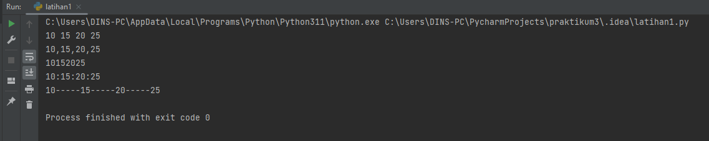

# PRAKTIKUM 3
## TUGAS PERTEMUAN KE 6 BAHASA PEMOGRAMAN

Nama : Selma Ohoira

NIM : 312210727

Kelas : TI.22.C9

Prodi : Teknik Informatika

Langkah-langkahnya yaitu :
1. Install Pycharm di https://www.jetbrains.com/pycharm/download/#section=windows
2. Pilih yang community

Tunggu hingga selesai dan program siap digunakan.
## CARA MENJALANKAN PYCHARM
## Latihan 1
1. Klik new project
2. Ketik nama project sesuai yang diinginkan.

3. Pilih Previously Configurred interperter lalu klik yang "add interperter" dan pilih "System interperter"
4. Pilih yang versi Python, seperti gambar di bawah ini

5. Selanjutnya membuat file Phyton baru dan beri nama file "latihan1"

## Penggunaan end
Parameter end berfungsi untuk mengganti karakter terakhir bawaan yang dicetak di layar.
Jadi secara bawaan, setiap kali kita memanggil fungsi print() untuk mencetak sesuatu,
python akan mencetak karakter ganti baris () di setiap output.
Masukan syntax berikut:

        #menampilkan karakter dengan mengosongkan karakter terakhir(yang seharusnya ganti garis)
        print('A', end='')
        print('B', end='')
        print('C', end='')

        #menampilkan ganti baris
        print()

        #menampilkan karakter
        print('X')
        print('Y')
        print('Z')

Hasil output

## Penggunaan separator
Separator adalah komponen yang menentukan pemisah yang akan digunakan saat memisahkan string.
Komponen ini bersifat optional. Masukan syntax berikut:

        #input variabel
        w, x, y, z = 10, 15, 20, 25 

        #menampilkan varible
        print(w, x, y, z)

        #menampilkan varible dengan "," sebagai pemisah antar variable 
        print(w, x, y, z, sep=',')

        #menampilkan varible dengan tidak menggunakan pemisah antar variable 
        print(w, x, y, z, sep='')

        #menampilkan varible dengan ":" sebagai pemisah antar variable 
        print(w, x, y, z, sep=':')

        #menampilkan varible dengan "-" sebagai pemisah antar variable 
        print(w, x, y, z, sep='-----')

Hasil output

## Penggunaan string format
Fungsi format() berfungsi untuk melakukan pengaturan format string yang akan dicetak atau ditampilkan ke monitor.
Contoh syntax : format(value[, format_spec])

        #menampilkan karakter 0 dan karakter 10 yang di pangkatkan
        print(0, 10 ** 0)
        print(1, 10 ** 1)
        print(2, 10 ** 2)
        print(3, 10 ** 3)
        print(4, 10 ** 4)
        print(5, 10 ** 5)
        print(6, 10 ** 6)
        print(7, 10 ** 7)
        print(8, 10 ** 8)
        print(9, 10 ** 9)
        print(10, 10 ** 10)

        #menampilkan karakter 0 dengan rata kanan diposisi 3 dan karakter 10 yang rata kanan diposisi 16 dari posisi 3
        lalu karakter dipangkatkan(0 dan 1 menunjukan letak index, dini 0 = 0 dan 1 = 10)
        
        print('{0:>3} {1:>16}'.format(0, 10 ** 0))
        print('{0:>3} {1:>16}'.format(1, 10 ** 1))
        print('{0:>3} {1:>16}'.format(2, 10 ** 2))
        print('{0:>3} {1:>16}'.format(3, 10 ** 3))
        print('{0:>3} {1:>16}'.format(4, 10 ** 4))
        print('{0:>3} {1:>16}'.format(5, 10 ** 5))
        print('{0:>3} {1:>16}'.format(6, 10 ** 6))
        print('{0:>3} {1:>16}'.format(7, 10 ** 7))
        print('{0:>3} {1:>16}'.format(8, 10 ** 8))
        print('{0:>3} {1:>16}'.format(9, 10 ** 9))
        print('{0:>3} {1:>16}'.format(10, 10 ** 10))

Hasil output

## Latihan 2
Membuat Program dengan menggunakan formating dan konversi nilai variable

1. Buat new strach file "Latihan2"
2. Masukan syntax berikut :

        #input nilai variable
        a=input("masukkan nilai a:")
        b=input("masukkan nilai b:")

        #cetak nilai variable
        print("variabel a=",a)
        print("variabel b=",b)

        #cetak hasil operasi kedua variable dengan String Format
        print("hasil penggabungan {1}&{0}=%s".format(a,b) %(a+b))

        #konversi nilai variabel
        a=int(a)
        b=int(b)
        print("hasil penjumlahan {1}+{0}=%s".format(a,b) %(a+b))
        print("hasil penjumlahan {1}/{0}=%s".format(a,b) %(a/b))

Hasil output latihan2

## Latihan 3
Membuat program yang menghasilkan gambar seperti diamond dengan string formating

1. Buat new stracth "Latihan3"
2. Masukan syntax berikut :

        #menampilkan kalimat
        print("Hello ini script python")

        #menampilkan ganti baris
        print()

        #menampilkan karakter * dengan rata kanan diposisi 12
        
        print('{0:>12}'.format('*'))

        #menampilkan karakter * dengan rata kanan diposisi 12 lalu dipangkatkan 2 dan
        menampikan karakter terakhir * yang dipangkatkan lalu menampilkan garis ganti

        print('{0:>12}'.format('*'*2), end='*'*1)
        print()
        print('{0:>12}'.format('*'*3), end='*'*2)
        print()
        print('{0:>12}'.format('*'*4), end='*'*3)
        print()
        print('{0:>12}'.format('*'*5), end='*'*4)
        print()
        print('{0:>12}'.format('*'*4), end='*'*3)
        print()
        print('{0:>12}'.format('*'*3), end='*'*2)
        print()
        print('{0:>12}'.format('*'*2), end='*'*1)
        print()

        #menampilkan karakter * dengan rata kanan diposisi 12
        print('{0:>12}'.format('*'))

Hasil output latihan3

## TUGAS
## MENGHITUNG LUAS DAN KELILING LINGKARAN
1. Buat new stratch "Praktikum3"
2. Masukan syntax berikut :

        print('menghitung luas dan keliling lingkaran')
        print('________________________________________')

        r=float(input('masukkan nilai jari - jari :'))

        phi=3.14
        diameter=2*r

        luas=phi*r*r
        keliling=phi*2*r
        print('\nluasnya =', str("%.2f" % luas))
        print('kelilingnya =', str("%.2f" % keliling))

Hasil Run

## Flowchart menghitung luas dan keliling lingkaran

SELESAI!!