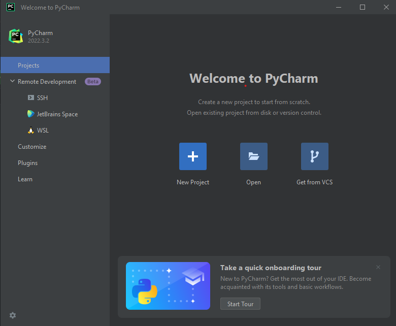

# Praktikum-3
## Tugas Bahasa Pemograman pertemuan 6

Nama : Selma Ohoira

NIM : 312210727

Kelas : TI.22.C9

Prodi : Teknik Informatika

Langkah-langkahnya yaitu :
1. Install Pycharm di https://www.jetbrains.com/pycharm/download/#section=windows
2. Pilih yang community

Tunggu hingga selesai, dan program siap digunakan.

### CARA MENJALANKAN PYCHARM
# Latihan 1
1. Klik new project
2. Ketik nama project sesuai yang diinginkan.

3. Pilih Previously Configurred interperter lalu klik yang "add interperter" dan pilih "System interperter"
4. Pilih yang versi Python, seperti gambar di bawah ini

5. Selanjutnya membuat file Phyton baru dan beri nama file "latihan1.py"

6. Masukan source code berikut:

# Penggunaan end
print('A', end='')
print('B', end='')
print('C', end='')
print()
print('X')
print('Y')
print('Z')

# Penggunaan separator
w, x, y, z = 10, 15, 20, 25
print(w, x, y, z)
print(w, x, y, z, sep=',')
print(w, x, y, z, sep='')
print(w, x, y, z, sep=':')
print(w, x, y, z, sep='-----')

# String format
print(0, 10 ** 0)
print(1, 10 ** 1)
print(2, 10 ** 2)
print(3, 10 ** 3)
print(4, 10 ** 4)
print(5, 10 ** 5)
print(6, 10 ** 6)
print(7, 10 ** 7)
print(8, 10 ** 8)
print(9, 10 ** 9)
print(10, 10 ** 10)

# String format
print('{0:>3} {1:>16}'.format(0, 10 ** 0))
print('{0:>3} {1:>16}'.format(1, 10 ** 1))
print('{0:>3} {1:>16}'.format(2, 10 ** 2))
print('{0:>3} {1:>16}'.format(3, 10 ** 3))
print('{0:>3} {1:>16}'.format(4, 10 ** 4))
print('{0:>3} {1:>16}'.format(5, 10 ** 5))
print('{0:>3} {1:>16}'.format(6, 10 ** 6))
print('{0:>3} {1:>16}'.format(7, 10 ** 7))
print('{0:>3} {1:>16}'.format(8, 10 ** 8))
print('{0:>3} {1:>16}'.format(9, 10 ** 9))
print('{0:>3} {1:>16}'.format(10, 10 ** 10))

7. Lalu run

Hasil run

# Latihan 2
1. Buat new strach file "Latihan2.py"
2. Masukan source code berikut :
a=input("masukkan nilai a:")
b=input("masukkan nilai b:")
print("variabel a=",a)
print("variabel b=",b)
print("hasil penggabungan {1}&{0}=%s".format(a,b) %(a+b))

#konversi nilai variabel
a=int(a)
b=int(b)
print("hasil penjumlahan {1}+{0}=%s".format(a,b) %(a+b))
print("hasil penjumlahan {1}/{0}=%s".format(a,b) %(a/b))

Hasil run

# Latihan 3
1. Buat new stracth "Latihan3.py"

2. Masukan source code berikut :

string = ""

x = int(input("Masukkan angka :"))
bar = x

# Looping Baris
while bar >= 0:
# Looping Kolom Spasi Kosong
kol = bar
while kol > 0:
string = string + " "
kol = kol - 1
# Looping Kolom Bintang Sisi Kiri
kiri = 1
while kiri < (x - (bar-1)):
string = string + " * "
kiri = kiri + 1
# Looping Kolom Bintang Sisi Kanan
kanan = 1
while kanan < kiri -1:
string = string + " * "
kanan = kanan + 1

string = string + "\n\n"
bar = bar - 1

bar = 1
# Looping Baris
while bar <= x:
kol = bar+1
# Looping Kolom Spasi Kosong
while kol > 1:
string = string + " "
kol = kol - 1
# Looping Kolom Bintang Sisi Kiri
kiri = 0
while kiri < (x - bar):
string = string + " * "
kiri = kiri + 1
# Looping Kolom Bintang Sisi Kanan
kanan = kiri
while kanan > 1:
string = string + " * "
kanan = kanan - 1
string = string + "\n\n"
bar = bar + 1
print (string)

Hasil Run

## TUGAS PRAKTIKUM 3

## MENGHITUNG LUAS DAN KELILING LINGKARAN
1. Buat new stratch "Praktikum3.py"
2. Masukan source code berikut :
print('menghitung luas dan keliling lingkarang')
print('________________________________________')

r=float(input('masukkan nilai jari - jari :'))

phi=3.14
diameter=2*r

luas=phi*r*r
keliling=phi*2*r
print('\nluasnya =', str("%.2f" % luas))
print('kelilingnya =', str("%.2f" % keliling))

Hasil Run

# Flowchart Menghitung luas dan keliling lingkaran

SELESAI!!